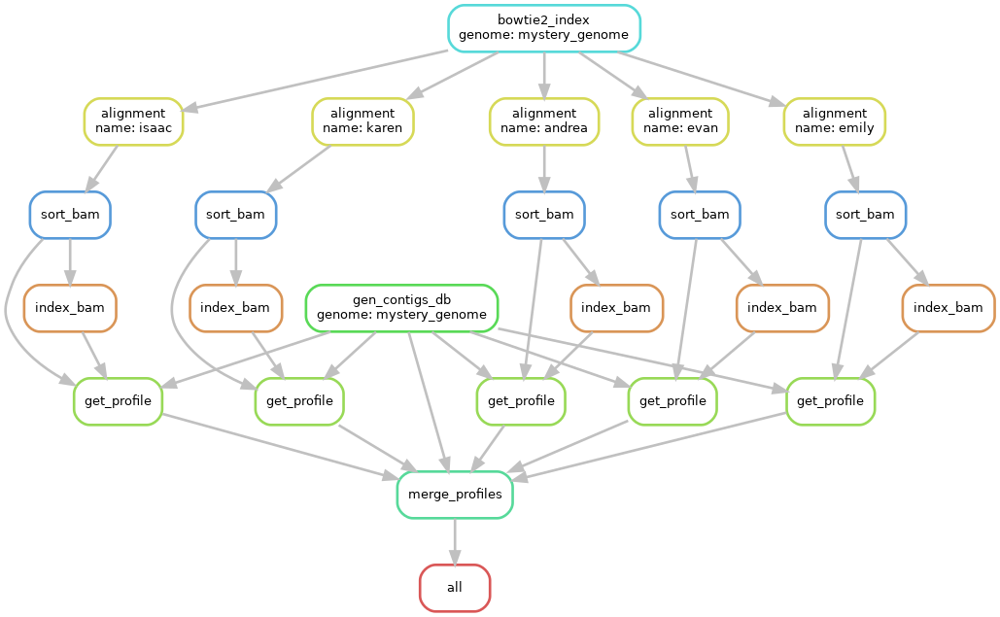
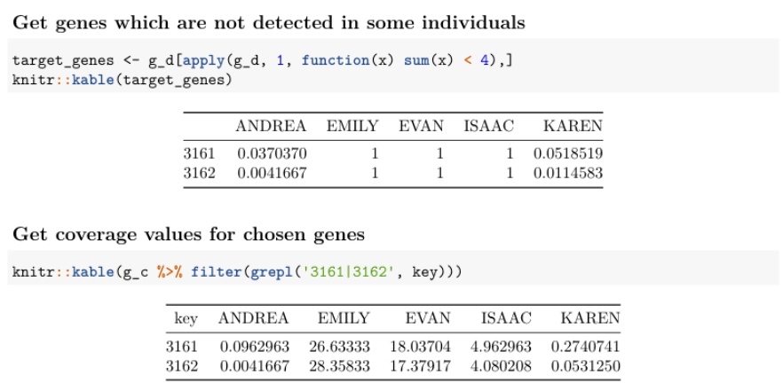
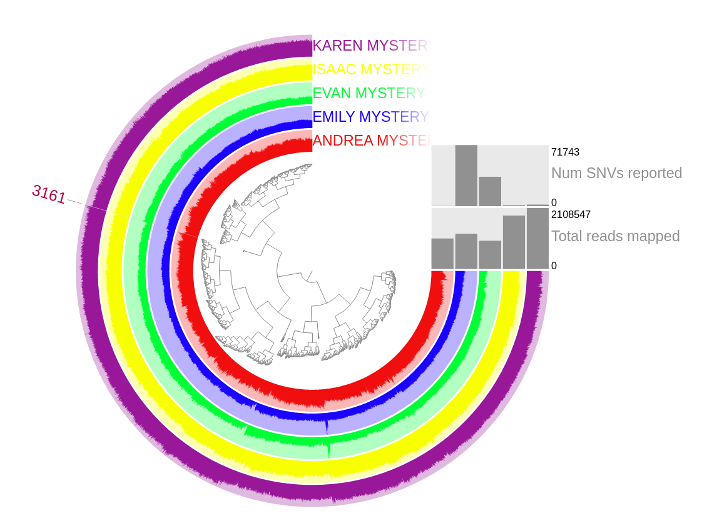

## Description

For this task, I prepared snakemake pipeline with certain conda environment. To reproduce this pipeline,
you should run this command in your terminal:

```commandline
snakemake -j 1 --use-conda --conda-prefix $(pwd)
```

Pipeline structure:



## Server part

Since Snakemake doesn't provide option to work with server interactivle since this mode doesn't generate
output files, I run the commands mannually:

```commandline
anvi-run-hmms -c genomes/mystery_genome.db
anvi-setup-scg-databases
anvi-run-scg-taxonomy -c genomes/mystery_genome.db
anvi-export-gene-coverage-and-detection -p merged_profiles/PROFILE.db -c genomes/mystery_genome.db -O mystery_bins
anvi-script-add-default-collection -p merged_profiles/PROFILE.db -c genomes/mystery_genome.db -b MY_BINS
anvi-estimate-scg-taxonomy -c genomes/mystery_genome.db --metagenome-mode
anvi-summarize -p merged_profiles/PROFILE.db -c genomes/mystery_genome.db -C DEFAULT -o SUMMARY
anvi-interactive -p merged_profiles/PROFILE.db -c genomes/mystery_genome.db -C DEFAULT -b MY_BINS --gene-mode
```

## Results

#### 1) What is this genome?

```commandline
$ grep '>' SUMMARY/bin_by_bin/MY_BINS/MY_BINS-Ribosomal_RNAs-hmm-sequences.txt | sed 's/rRNA.*/rRNA/g' | sort | uniq
>Archaeal_23S_rRNA
>Bacterial_16S_rRNA
```

The genome contains contigs which match with both Archaeal_23S_rRNA and Bacterial_16S_rRNA genes. 

#### 2) Does every gene in this genome occur in every individual?

The answer is no.

#### 3) If not, which genes are differentially distributed, and what are those genes?

Using `mystery_bins-GENE-DETECTION.txt` file, I found multiple genes which are not detected in some individuals.

In `obtain_genes.pdf` file you can see how I filter genes which were found in all individual and 
prepare result table with genes which total sum across all individual less than 4.

Here is the summary tables:



Here how coverage for *3161* gene looks like:


If I zoom in, I can easily see how coverage falls on this gene in both ANDREA, KAREN and ISAAC individuals. 