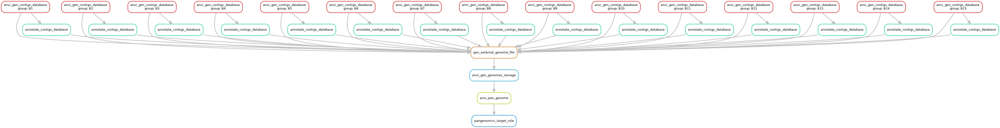
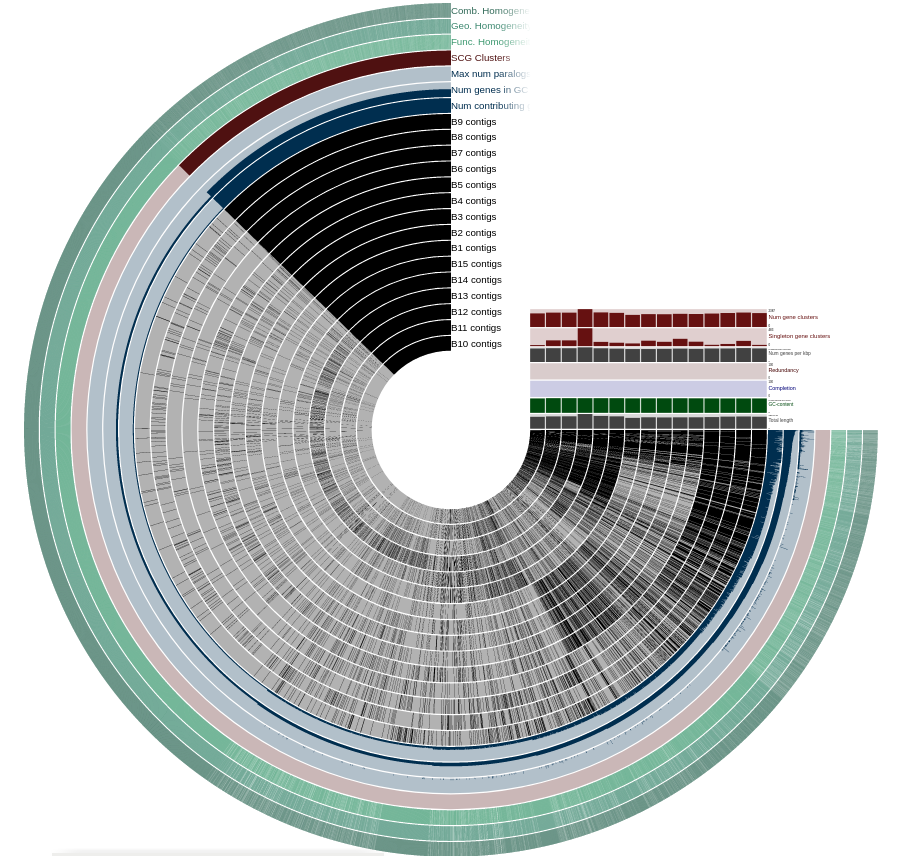
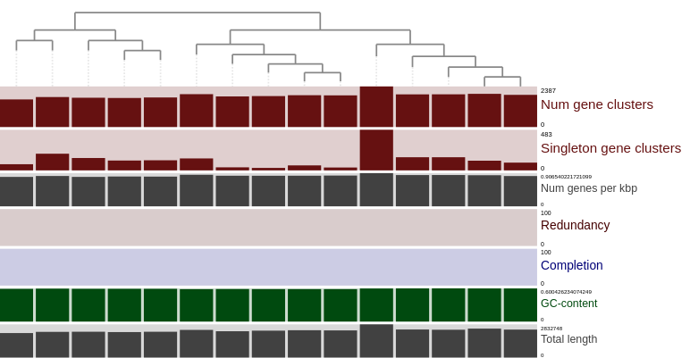
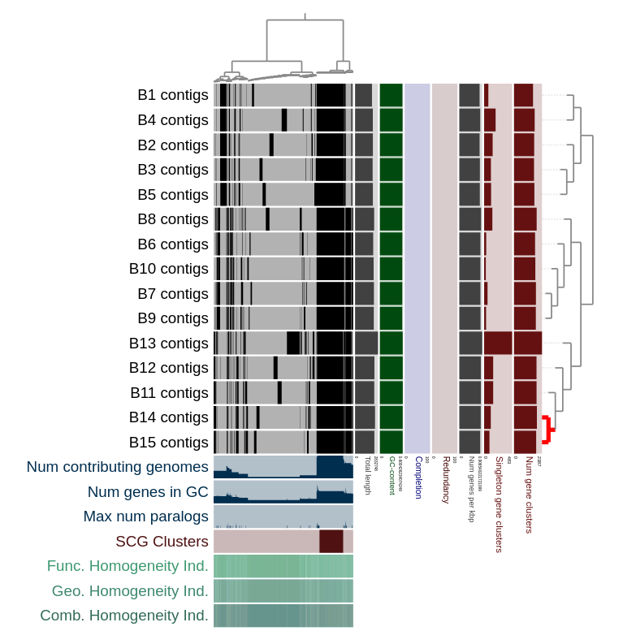

## Description

For this homework, I used prepared snakemake workflow by anvi team.

Firsly, I prepared some config files required for the workflow: see both `config.json` and `fasta.txt` files.

Secondly, I generated the pipeline graph:

```commandline
anvi-run-workflow -w pangenomics -c config.json --save-workflow-graph
```



Thirdly, I run the workflow using this command:

```commandline
anvi-run-workflow -w pangenomics -c config.json
```

Lastly, I run the server:

```commandline
anvi-display-pan -g 03_PAN/hw2_Bifidobacterium-GENOMES.db -p 03_PAN/hw2_Bifidobacterium-PAN.db
```

## Results

#### 1) How many single-copy core genes did you find?




The answer is 1.

#### 2) When you organize genomes based on gene cluster frequencies, how many main groups do you observe?



The answer is 2.

#### 3) Which species name would you annotate these genomes with?

For this purpose, I used blastn for each contig fasta file

* 1 - Bifidobacterium adolescentis ATCC
* 2 - Bifidobacterium adolescentis strain 22L
* 3 - Bifidobacterium adolescentis isolate MGYG-HGUT-02395
* 4 - Bifidobacterium adolescentis strain 1-11
* 5 - Bifidobacterium adolescentis strain
* 6 - Bifidobacterium breve 12L
* 7 - Bifidobacterium breve 689b
* 8 - Bifidobacterium breve JCM 7019
* 9 -Bifidobacterium breve NCFB 2258
* 10 - Bifidobacterium breve S27
* 11 -Bifidobacterium longum subsp. longum GT15
* 12 - Bifidobacterium longum strain Su859
* 13 - Bifidobacterium longum isolate MGYG-HGUT-01292
* 14 - Bifidobacterium longum subsp. infantis CECT7210 
* 15 - Bifidobacterium longum subsp. longum F8

#### 4) According to gene clusters, which two species of Bifidobacterium in this mixture are most closely related?



I see that both B14/B15 and B7/B9 contig pairs have close phylogenetics relationships.

As for B7/B9, organisms are:

* 7 - Bifidobacterium breve 689b
* 9 -Bifidobacterium breve NCFB 2258

As for B14/B15, organisms are:
* 14 - Bifidobacterium longum subsp. infantis CECT7210 
* 15 - Bifidobacterium longum subsp. longum F8
 

#### 5) What are the most enriched functions for each of the major clades in the final pangenome? (Pro tip: functional enrichment analysis is covered in the tutorial).

The answer is HMO consumption.