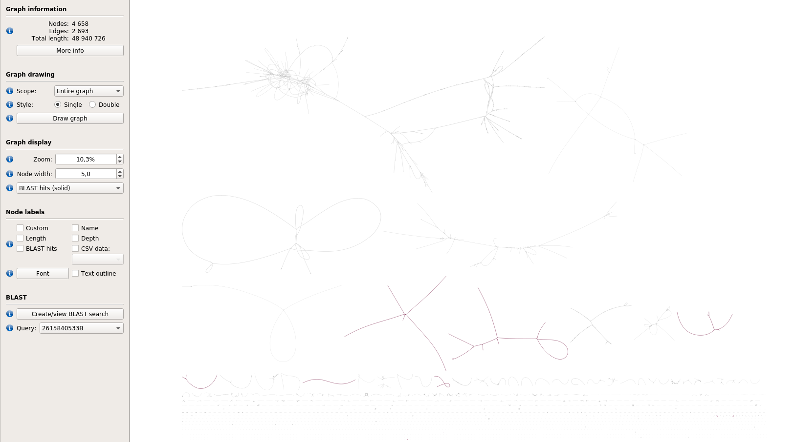
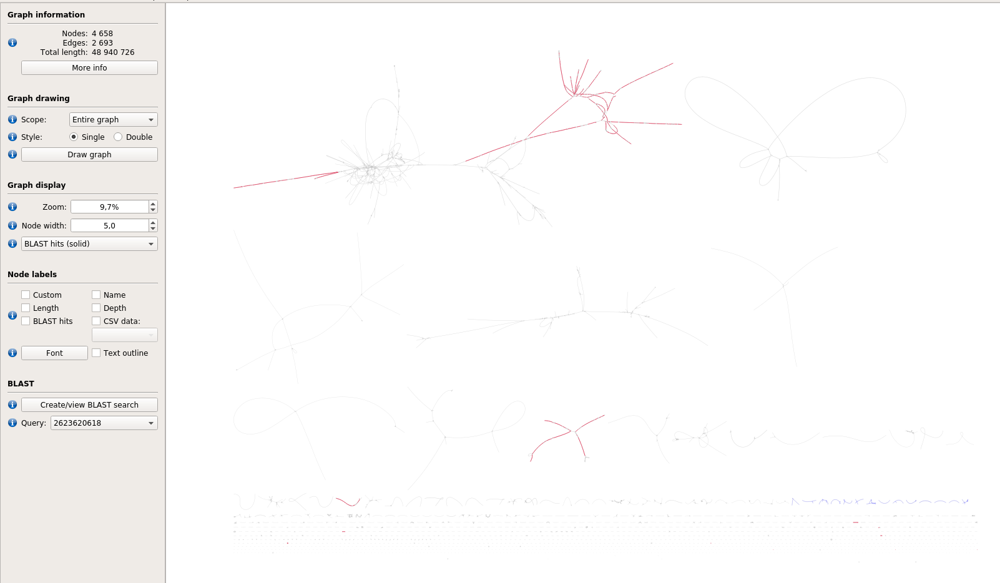
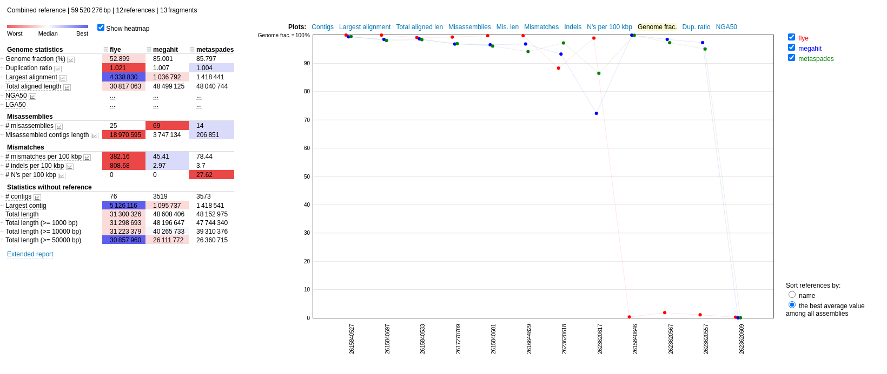

Task. Look at the swarm of small contigs in the bottom of the picture. What do you think is the reason they are so fragmented? Confirm your suspicion by checking MEGAHIT’s depth estimates (and displayed by Bandage) for some of them.

answer: mean depth is really low

Task: Highlight the subgraph, corresponding to genome 533 (it is represented by two sequences 533A and 533B). What is the major difference with the previous one? Check out coverage depth of the 533 genome.

533:

533A: 56x
533B: 27, 40x

Task. Look at alignments for genomes 617 and 618. Weird, right? :) And what are all those bubbles? Check out reference files (or reference info from publication) to see if the organism names will help explaining the situation.
Intraspecies microdiversity is a major origin of short and/or incorrect contigs, incomplete MAGs (and headaches...).
Also note how weirdly fragmented the 617/618 subgraph is, despite HIGH coverage. My current hypothesis is that strain differences may be interfering with the local reassembly process in MEGAHIT. But it will need further investigation.

618:

617: >2623620617 Ga0071313_11 Halomonas sp. HL-4 : Ga0071313_11

618: >2623620618 Ga0071314_11 Halomonas sp. HL-93 : Ga0071314_11

Task: Look at alignments for genomes 697 and 829. Let’s check how similar they are by computing the Average Nucleotide Identity (ANI) index (cool calculator can be found here). Note that even at that similarity level the genomes ended up sharing quite a few 141-mers.
Game: can you spot longer nodes shared by the two genomes? (I have found this one: node 159) 

queued

Task. Which genomes do you think are represented by the only (large) tangled component? Check your suspicion!

618 + 709 + 829 + 617 + 697

Task. Look at the GF (genome fraction) stats for 557 and 567. Note how different they are for Illumina and ONT assemblies. What do you think is the reason? You can take a look at 557 and 567 contigs in the graph.

557: 1.088 flye, 99+ other
567: same story

